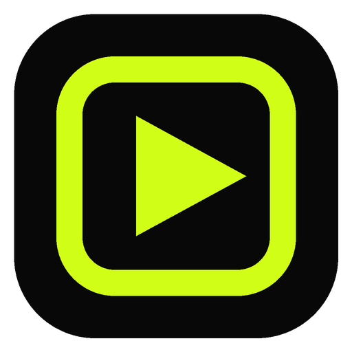

  

<h1 align="center">LiveShive</h1>

<b>by Haris AI</b>

Paste a live stream link. Get captioned 9:16 clips while you are still live.

  <a href="https://github.com/Ai-Haris/LiveShive-Releases/releases/latest/download/LiveShive-Setup-Windows-x64.exe"><b>⬇ Download for Windows</b></a>
  &nbsp;·&nbsp;
  macOS: coming soon
  &nbsp;·&nbsp;
  <a href="https://ai-haris.github.io/LiveShive-Releases/">Website</a>

---

## Download

| Platform | Download |
|---|---|
| Windows 10 / 11 (64-bit) | [LiveShive-Setup-Windows-x64.exe](https://github.com/Ai-Haris/LiveShive-Releases/releases/latest/download/LiveShive-Setup-Windows-x64.exe) |
| macOS (Apple Silicon and Intel) | Coming soon |

The installer includes everything: the engine and FFmpeg. No Python or other setup needed.

## Features

- **Real-time live clipping** from YouTube, Twitch, Kick, Facebook and 1000+ sites
- **Screen + Face layout**: full 16:9 gameplay on top, captions in the middle, your face zoomed in below
- **Hinglish captions**: Hindi and Urdu written in Roman script; English stays English
- **12 trending caption styles**, fully customisable in Caption Studio
- **Finds the best moments** automatically: hooks, hype, loud reactions, clutches and headshots
- **Background music**: add MP3, WAV, M4A or MP4 files, trim any part, set the volume; music dips while you talk
- **One-click setup**: detects your CPU, RAM and GPU, then downloads only what your PC needs
- **GPU acceleration**: NVIDIA, Intel and AMD graphics render clips; NVIDIA cards can run captions too
- **Runs on any PC**: Light, Balanced or Power mode picked from your hardware

## System requirements

| | Minimum | Recommended |
|---|---|---|
| System | Windows 10 64-bit | Windows 11 64-bit |
| Processor | 2 cores / 4 threads | 8 cores / 12+ threads |
| Memory | 4 GB RAM | 16 GB RAM |
| Storage | 3 GB free | 20 GB free (SSD) |
| Graphics | Not needed | Not needed |

On first launch the Setup screen downloads the speech model (145 MB to 1.5 GB depending on your PC) and, on NVIDIA graphics cards, an optional 560 MB speed pack.

## Installing

1. Download `LiveShive-Setup-Windows-x64.exe`.
2. Run it. If Windows shows **"Windows protected your PC"**, click **More info → Run anyway**. The app is new and not code-signed yet.
3. Open LiveShive from the desktop shortcut, paste a stream link and press **Start clipping**.

Clips are saved to the `LiveShive` folder in your user folder, for example `C:\Users\you\LiveShive`.

---

© 2026 Haris AI. This repository hosts release builds only.
